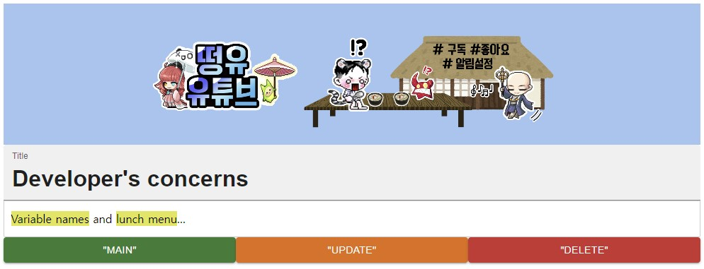

# [DYEditor](https://github.com/DongYu-Kim/DYEditor)
This is an example project using [dyeditor](https://www.npmjs.com/package/dyeditor) made with react. You can test the functions of dyeditor.

## Quick start
```bash
git clone https://github.com/DongYu-Kim/DYEditor.git

cd dyeditor
npm install
npm run start
```

## Screens



